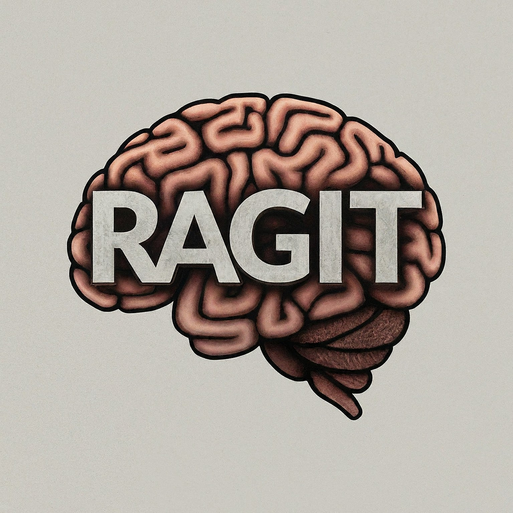

<p align="center">

</p>

[](https://twitter.com/dev_ragit)
[](https://adaptaware.org)
[](https://hub.docker.com/repository/docker/adaptaware/ragit/general)
[](https://hub.docker.com/repository/docker/adaptaware/ragit-back-end/general)
[](https://github.com/adaptaware/ragit/blob/main/LICENSE)


# Table of Contents

- [What is RAGit](#what-is-ragit)
- [Development Environment](#development-environment)
- [Running RAGit using docker](#running-ragit-using-docker)
- [RAG Collection](#rag-collection)
- [The env file for Docker](#the-env-file-for-docker)
- [Back up and Restore](#back-up-and-restore)
- [Data pipeline overview](#data-pipeline-overview)
- [Why Use Vagrant For Development](#why-use-vagrant-for-development)

# What is RAGit

Welcome to the official documentation for **RAGit**, an open-source framework designed to streamline the development and management of Retrieval-Augmented Generation (RAG) solutions. RAGit eliminates the complexities associated with data handling, model selection, and infrastructure setup, empowering developers to concentrate on application logic and customization.

Whether you're working for a small to medium-sized business or seeking a personal solution for creating custom chatbots, RAGit offers a versatile platform to meet your needs. It supports document integration through a command-line interface capable of handling various Large Language Models (LLMs) and vector databases. Meanwhile, the intuitive, web-based front end ensures a user-friendly experience for deploying and managing your applications.


The core values and principles behind RAGit can be summarized as follows:

**Open Source**

RAGit is proudly offered under the GPL license, ensuring it remains open source
for all current and future users.

**Generality**

RAGit is adaptable to any dataset, accommodating a wide array of data types.
This flexibility provides a robust foundation for crafting customized RAG
applications.

**Simplicity**

Our framework prioritizes user-friendliness by abstracting complex data
management processes. With RAGit, you can focus on refining document selection
and optimizing outcomes without delving into intricate implementation details.

**Configurability**

RAGit offers a high degree of customization. Experiment with hyperparameters,
explore various chunk splitting strategies, adjust vector distance algorithms,
and apply prompt engineering to gain full control over your RAG pipeline.

**Comprehensiveness**

Beyond model training and inference, RAGit equips you with tools for efficient
data ingestion, processing, and management, supporting every phase of your
project.

**Vendor Neutrality**

RAGit remains agnostic to specific technologies, allowing for easy integration
and switching between diverse components and services.

By embracing these guiding principles, RAGit accelerates the creation of
effective and robust RAG solutions. Explore our framework to harness its full
potential and drive your projects forward.


# Development Environment

The recommended development platform for RAGit is based on Vagrant.  To have a fully
functionall Vagrant box you can follow these:
## Build the virtual machine

To install and run RAGIT locally the easiest way is to use a virtual machine
that can be created using [vagrant](https://developer.hashicorp.com/vagrant/install#darwin).
You will need to have vagrant installed on your machine .

Assuming you already have vagrant installed then you need to follow these steps
to install the repository under your home directory (you can always install it
in any other directory if needed).

```
cd ~
git clone git@github.com:adaptaware/ragit.git
mkdir ~/ragit-data
cd ragit
vagrant up
vagrant ssh
```

Now you can ssh to the newly created virtual machine which should be ready
to go.

## The ragit-data directory

The ragit-data directory is shared between the host and guest machine and it
contains all the RAG collections.

Each RAG Collection is stored under a subdirectory of the ragit-data directory.
The name of the subdirectory is the name of the RAG collection as well.
Inside this subdirectory must be another subdirectory called documents which
contains all the documents (pdf, markdown, docx etc) that are used for the RAG
collection.

**The dummy RAG Collection**
For testing purposes we need one special collection named dummy which will be
used by some of the intergration and functional tests for the application.

To create the dummy collection and assuming you are inside the vagrant box
follow these steps:

```
mkdir -p ~/ragit-data/dummy/documents
cp -R /vagrant/ragit/libs/testing_data/* ~/ragit-data/dummy/documents
```

At this point your ragid-data directory should look similar to the following:

```
ragit-data/
├── dummy
│   └── documents
│       ├── hello-world.docx
│       ├── hello_world.py
│       ├── nested_dir
│       │   ├── method-chaining.md
│       │   └── nested_2
│       │       └── sample1.pdf
│       ├── patents.pdf
│       ├── sql-alchemy-sucks.md
│       └── sunhaven.md
```

## Install the python dependencies

The required python libraries can be installed as follows:

```
pip3 install -r /vagrant/requirements.txt
```

## Create the settings file.

Under your vagrant's machine home directory `/home/vagrant` create a new file
called `settings.json` and store into it a valid OpenAI key in the following
format:

```json
{
    "OPENAI_API_KEY": "<valid-open-ai-key>",
    "VECTOR_DB_PROVIDER": "<supported-vector-db>",
    "LLAMA_CLOUD_API_KEY": <LLAMA_CLOUD_API_KEY>

}
```

You can get the LLAMA_CLOUD_API_KEY from this link: https://cloud.llamaindex.ai/

The LLAMA_CLOUD_API_KEY is needed for the pdf to markdown transformation.

The supported vector databases are the following:

- CHROMA
- MILVUS


## Run the tests

You can verify your setup by running all the tests by following these commands:

```
cd /vagrant/ragit/
pt
```

## Run Ragit Backend Utility

At this point you should have a successfully installed RAGit application along
with a RAG collection that you can use similarly to any other RAG collection
you are going to create.

**Build the backend**

To create the necessary backend processing which includes:

- Preprocessing the documents under the RAG collection
- Splitting the documents to chunks
- Creating the embeddings for each chunk
- Insert the updates to the vector database

you should use the `ragit` command line application which can start by running
the command `ragit` anywhere from insider the vagrant box which should bring up
the following options:

```
(ssh)vagrant@ragit:/vagrant/ragit$ ragit
Welcome to the RAG Collection Tracker. Type help or ? to list commands.

(RAGit)
```

**Show all the commands**

entering the `help` or `?` we can see all the available commands:

```
(RAGit) ?

l (list): List all available collections.
s (stats) <name>: Print its stats for the pass in collection.
p (process): Process the data the passed in collection.
m (create_markdowns): Creates missing markdowns.
h (help): Prints this help message.
e (exit): Exit.
```

**Show all the RAG collections**

to see all the available collections we enter `list` or `l`:

```
(RAGit) list
dummy
(RAGit)
```
since we only have created only the `dummy` collection this the only one we
see.

**Show all the statistics for a RAG collection**

If we press `stats dummy` or `s dummy` we see the stats of the statistics for
the `dummy` collection:

```

(RAGit) s dummy
name.....................: dummy
full path................: /home/vagrant/ragit-data/dummy/documents
total documents..........: 5
total documents in db....: 0
total chunks.............: 0
with embeddings..........: 0
without embeddings.......: 0
inserted to vectordb.....: 0
to insert to vector db...: 0
total pdf files..........: 2
pdf missing markdowns....: 2
(RAGit)

```

The above result tells us that we have 5 non pdf documents and 2 pdf in the RAG
collection.

It also tell us that that the pdf files are missing both their conversion to
markdowns while nothing is inserted in the database of the vectordb.

**Create the markdowns for the pdf**

To create the missing markdowns for the dummy collection we need to enter the
following command: `m dummy` or `create_markdowns dummy` as can be see here:

```
(RAGit) create_markdowns dummy
```
or 

```
(RAGit) m dummy
```

Now the statistics for the dummy collection look as follows:

```
(RAGit) s dummy
name.....................: dummy
full path................: /home/vagrant/ragit-data/dummy/documents
total documents..........: 9
total documents in db....: 0
total chunks.............: 0
with embeddings..........: 0
without embeddings.......: 0
inserted to vectordb.....: 0
to insert to vector db...: 0
total pdf files..........: 2
pdf missing markdowns....: 0
(RAGit)

```

as we can see we have no more missing markdowns. Still, as we can see
we need to process the documents and insert them to the vector db which will
make the RAG collection ready to serve client queries.

**Process the documents**

To process the documents we need to enter the `process dummy` or `p dummy`
command:


```
fix this
```

Now the stats for the collection look as follows:

```
(RAGit) s dummy
name.....................: dummy
full path................: /home/vagrant/ragit-data/dummy/documents
total documents..........: 9
total documents in db....: 9
total chunks.............: 73
with embeddings..........: 73
without embeddings.......: 0
inserted to vectordb.....: 73
to insert to vector db...: 0
total pdf files..........: 2
pdf missing markdowns....: 0
(RAGit)

```

and as we can see we have 73 chunks while all of the were inserted to the
vector db and are ready for processing.

## Run Ragit Front End

**Starting RAGit web server**

The front end of RAGit is a web-based service that can be started as follows:

```
(ssh)vagrant@ragit:/vagrant/ragit$ cd /vagrant/ragit/front_end/
(ssh)vagrant@ragit:.../ragit/front_end$ python3 app.py dummy
```

as we can see we can pass the RAG collection name that we need to process, here
is `dummy` in the command line; doing so will create some output similar to the
following:

```
Running the RAGIT UI as not ADMIN
Loading vector db, using collection dummy
fix this
```

The query / answer we see here is just a self test to validate the connectivity
to the LLM and the vectordb and can differ from run to run.

The server was started in port `13131` while the port to access it from the
'outside' is the one we have specified in the Vagrant file in the following
line:

```
config.vm.network "forwarded_port", guest: 13131, host: 13132
```

thus in this case the port will be 13132 (it can be anything else is convinient
for the host machine as well).

**Accessing the RAGit web page**

From the browser we can access the RAGit web page using the following url:

```
localhost:13132
```

**Sign up / Login**
The first time we are accessing the RAGit webserver we will need to sign up and
then use the user name and password to login to the front end.

**Start quering the RAG collection**

Once we are signed in, the environment should look familier to other chatbots.


**Checking the chunks for the response**

If we want to see the documents where the above response was originated from we
click in `History` option as can be seen here:


**Viewing the full document where the chunk is coming from**

By clicking the link to the name of the document we can see the full document where the chunk is coming from:


# Running RAGit using docker

# Deployment Steps

This documentation provides instructions for deploying a standalone  RAGIT application using Docker.

## Create the docker-compose file

- Create a new directory in any location you prefer where you will store all necessary files for deployment.

- Under this directory create a file named `docker-compose.yaml` with the following content:

```
version: "3.8"

services:
    frontend:
      image: adaptaware/ragit:1.0
      environment:
        - OPENAI_API_KEY=${OPENAI_API_KEY}
        - SERVICE_PORT=${INTERNAL_FRONT_END_PORT}
        - RAG_COLLECTION=${RAG_COLLECTION}
        - VECTOR_DB_PROVIDER=${VECTOR_DB_PROVIDER}
      volumes:
        - ${SHARED_DIR}:/root/ragit-data
      ports:
        - "${EXTERNAL_FRONT_END_PORT}:${INTERNAL_FRONT_END_PORT}"
    backend:
        image: adaptaware/ragit-back-end:1.0
        environment:
            - OPENAI_API_KEY=${OPENAI_API_KEY}
            - POSTGRES_DB=${POSTGRES_DB}
            - POSTGRES_USER=${POSTGRES_USER}
            - POSTGRES_PASSWORD=${POSTGRES_PASSWORD}
            - POSTGRES_PORT=${POSTGRES_PORT}
            - POSTGRES_HOST=${POSTGRES_HOST}
            - VECTOR_DB_PROVIDER=${VECTOR_DB_PROVIDER}
        volumes:
            - ${SHARED_DIR}:/root/ragit-data
        stdin_open: true  # Keep stdin open even if not attached
        tty: true         # Allocate a pseudo-TTY
    db_host:
      image: postgres:latest
      environment:
        - POSTGRES_DB=${POSTGRES_DB}
        - POSTGRES_USER=${POSTGRES_USER}
        - POSTGRES_PASSWORD=${POSTGRES_PASSWORD}
        - POSTGRES_PORT=${POSTGRES_PORT}
        - POSTGRES_HOST=${POSTGRES_HOST}
      volumes:
        - pgdata:/var/lib/postgresql/data
volumes:
  pgdata:
```

## Specify the Environment Variables

   - In the directory containing `docker-compose.yaml`, create a file named `.env` with the following content:

     ```plaintext
     OPENAI_API_KEY=<valid-api-key>
     BIND_ADDRESS=0.0.0.0
     EXTERNAL_FRONT_END_PORT=13133
     INTERNAL_FRONT_END_PORT=13131
     VECTOR_DB_PROVIDER=CHROMA
     SHARED_DIR=<your-home-directory>/ragit-data
     RAG_COLLECTION=<collection-name>
     ```
     In the above content replace `<valid-api-key>` with a valid API key and the `<collection-name>` with a valid collection name (following the above example the collection name would be stories).


   - **Customize Variables**:
     - Replace `valid-api-key` with your actual OpenAI API key.
     - Substitute `<your-home-directory>` with the full path to your **home directory**.
     - Set `collection-name` to your specific RAG collection name (e.g., `stories`).


## Create Shared Directory

Under the **HOME directory** create a `ragit-data` directory where the data for
all the collections will exist.

The structure should be as follows:


     <HOME-DIR>
     └── ragit-data
         └── <your-collection-name>
             └── documents


   - Note: Replace `your-collection-name` with your actual RAG collection name.

The directory name `documents` must always exist under the collection and this
is where you are placing all the documents that will consist the RAG
Collection. Documents can be nested and the directory structure of the
`documents` directory is completely up to the user of  RAGit to decide (again
the only restriction is to be under the `documents` directory as seen above.


## Running the Service

 Navigate to your deployment directory (where `docker-compose.yaml` is located) and execute the following:

#### Start the database

     ```bash
     docker-compose up -d db_host
     ```

#### Start the backend processor

     ```bash
     docker-compose run backend
     ```
#### From another CLI window start the front end

   - Navigate to your deployment directory (where `docker-compose.yaml` is located) and execute the following command to launch your Dockerized front end:

     ```bash
     docker-compose up -d frontend
     ```

#### Access the service
   Your RAGIT front end should now be operational and accessible locally through the specified external port as follows:

```
localhost:13133
```

or remotely
```
<ip-address>:13133
```

## Clean Up

If you need to start fresh with the Docker installation, you can run the following commands:

```sh
docker stop $(docker ps -aq); docker rm $(docker ps -aq); docker image rm -f $(docker images -q)
docker compose down -v
```


# RAG Collection

## Overview

A RAG collection is a fundamental component of the RAGit system. It is uniquely
identified by a `collection name` or simply `name`. This document outlines the
steps involved in creating and managing a custom RAG collection.

## Definition: RAG Collection (or simply Collection)

A `RAG Collection` is a collection of documents stored under the shared
directory (`ragit-data`). Assuming we have a collection called `mydata`, its
related data will exist under the following directory:

```sh
~/ragit-data/mydata/documents
```

## Prepare the Documents Directory

To create a new RAG collection, you need to prepare the documents directory
where your collection's documents will be stored.

**Create a Directory**

Create a directory to store your collection's documents:

```bash
mkdir -p ~/ragit-data/<collection-name>/documents
```

Replace `<collection-name>` with the desired name for your collection.

## Copy Relevant Documents

After you create the above directory, copy all relevant documents into the
newly created `documents` directory:

```bash
cp path/to/your/documents/* ~/ragit-data/<collection-name>/documents/
```

## Process Documents and Create Index

The `ragit` command is available from anywhere under the VM and can be used to
interact with the backend of the RAGit service. More precisely, the following
is the available functionality:

## Display Available RAG Collections

List all available RAG collections using the following command:

```sh
ragit -l
```

Example output:

```sh
dummy
mycode
stories
```

## Show the Statistics for a RAG Collection

Display statistics for a specific RAG collection using the following command,
replacing `<collection-name>` with your collection's name:

```sh
ragit -n <collection-name>
```

Example output:

```sh
name.....................: stories
full path................: /home/vagrant/ragit-data/stories/documents
total documents..........: 4
total documents in db....: 4
total chunks.............: 21
with embeddings..........: 21
without embeddings.......: 0
inserted to vectordb.....: 21
to insert to vector db...: 0
```

## Process the Data for a RAG Collection

Process the available documents for a specific RAG collection using the
following command, replacing `<collection-name>` with your collection's name:

```sh
ragit -n <collection-name> -p
```

Example output:

```sh
Will insert all available chunks to the database.
Inserted 0 chunks.
Will insert all available embeddings to the database.
Inserted 0 embeddings.
updating the vector db.
Totally inserted records: 0
Inserted 0 chunks to the vector db.
```

## Summary

By following these steps, you can create and manage a custom RAG collection
within the RAGit framework. This process involves setting up the documents
directory, copying relevant documents, and using RAGit's command-line tools to
process and manage your collection. This ensures that your data is properly
indexed and ready for use in RAG-based applications.


# The env file (for Docker)

## Overview

The `.env` file is crucial for configuring environment-specific variables for
the RAGIT application when running inside DOCKER.

This file allows you to manage various settings such as
API keys, database credentials, and application ports in a centralized manner.
This guide explains the purpose of each variable in the `.env` file and how to
set them up correctly.

## Example .env File

Below is an example of a `.env` file:

```env
OPENAI_API_KEY=<valid-openai-key>
POSTGRES_DB=postgres
POSTGRES_USER=postgres
POSTGRES_PASSWORD=mypassword
POSTGRES_PORT=5432
POSTGRES_HOST=db_host
EXTERNAL_FRONT_END_PORT=13133
INTERNAL_FRONT_END_PORT=8789
VECTOR_DB_PROVIDER=<CHROMA or MILVUS>
SHARED_DIR=<path-to-shared-directory>
RAG_COLLECTION=<your-rag-collection-name>
```

The Configuration Parameters are the following:

## OPENAI_API_KEY
- **Description**: The API key for accessing OpenAI's services.
- **Format**: String
- **Example**: `OPENAI_API_KEY=sk-xxxxxx`

## POSTGRES_DB
- **Description**: The name of the PostgreSQL database.
- **Format**: String
- **Example**: `POSTGRES_DB=postgres`

## POSTGRES_USER
- **Description**: The username for accessing the PostgreSQL database.
- **Format**: String
- **Example**: `POSTGRES_USER=postgres`

## POSTGRES_PASSWORD
- **Description**: The password for accessing the PostgreSQL database.
- **Format**: String
- **Example**: `POSTGRES_PASSWORD=mypassword`

## POSTGRES_PORT
- **Description**: The port number on which the PostgreSQL database is running.
- **Format**: Integer
- **Example**: `POSTGRES_PORT=5432`

## POSTGRES_HOST
- **Description**: The hostname or IP address where the PostgreSQL database is hosted.
- **Format**: String
- **Example**: `POSTGRES_HOST=db_host`

## EXTERNAL_FRONT_END_PORT
- **Description**: The external port number for accessing the RAGIT web application.
- **Format**: Integer
- **Example**: `EXTERNAL_FRONT_END_PORT=13133`

## INTERNAL_FRONT_END_PORT
- **Description**: The internal port number the frontend service listens on.
- **Format**: Integer
- **Example**: `INTERNAL_FRONT_END_PORT=8789`

## VECTOR_DB_PROVIDER
- **Description**: Specifies the vector database provider to be used.
- **Options**: `CHROMA` or `MILVUS`
- **Example**: `VECTOR_DB_PROVIDER=CHROMA`

## SHARED_DIR
- **Description**: The path to the shared directory that holds the data collection.
- **Format**: Full path (String)
- **Example**: `SHARED_DIR=/home/user/ragit-data`
- **Note**: This path should be accessible by both the host and guest machine/containers.

## RAG_COLLECTION
- **Description**: The name of the RAG collection to be used.
- **Format**: String
- **Example**: `RAG_COLLECTION=stories`
- **Note**: This should correspond to the sub-directory under `SHARED_DIR` where the collection data is stored.

## Setting Up the .env File

1. **Create the .env File**: In the root directory of the RAGIT repository, create a file named `.env`.

   ```sh
   touch .env
   ```

2. **Add Configuration Parameters**: Open the `.env` file in your preferred text editor and add the configuration parameters as shown in the example above. Replace placeholder values (like `<valid-openai-key>`, `<path-to-shared-directory>`, and `<your-rag-collection-name>`) with actual values appropriate for your environment.

Example:

```env
OPENAI_API_KEY=sk-abcdefghijklmnopqrstuvwxy1234567890
POSTGRES_DB=postgres
POSTGRES_USER=postgres
POSTGRES_PASSWORD=secretpassword
POSTGRES_PORT=5432
POSTGRES_HOST=db_host
EXTERNAL_FRONT_END_PORT=13133
INTERNAL_FRONT_END_PORT=8789
VECTOR_DB_PROVIDER=CHROMA
SHARED_DIR=/home/user/ragit-data
RAG_COLLECTION=stories
```

3. **Save and Close**: Save the changes and close the text editor.

## Summary

The `.env` file plays a vital role in configuring the RAGIT application by
centralizing critical environment variables. By properly setting up this file,
you ensure that all components of the RAGIT application can easily access the
necessary configuration settings, leading to a smoother and more efficient
deployment process.


# Back up and Restore

The structure of the directory holding your ragit collection should be the
following:

```
<your-collection-name>
├── documents
├── registry
└── vectordb
    └── <your-collection-name>-chroma-vector.db
```

## Backup the psql database

In postgres there should be a database named <your-collection-name> which holds
the chunks used and also information about what has been inserted to the
vectordb to keep housekpeeing clean. We need to create a backup of it to add it
to the registry and the vectordb files so we will be able to completely restore
all the related data.

From the vagrant machine to backup a RAG collection you need to run the
`make_backup.sh` utility from the `/vagrant/ragit/utils` passing the name of the
collection as the only argument to the command as can be seen here:

```
cd /vagrant/ragit/utils
 ./make_backup.sh dummy
```

The above command will create a tarball named `dummy.tar.gz` under the roor
directory of the shared directory (by default `~/ragit-data`)

This tarball we can move it to any directory we like to use as the backup
container.


## Restoring a RAG collection

To restore a RAG collection using its backup tarball we can use the
`restore_backup.py` python script that is locatio under the
`/vagrant/ragit/utils` directory as can be seen here:


```
cd /vagrant/ragit/utils
python3 restore_backup.py dummy.tar.gz
```

Upon completion of the above script the `dummy` directory will be created under
the shared directory (by default `~/ragit-data`).

Still we will need to create the database manually as can be seen here:

```
cd ~/ragit-data/dummy
dropdb -U postgres dummy
createdb -U postgres dummy
psql -U postgres -d dummy -f dummy.sql
```

At this point you should have a fully functional database and RAG collection in
general and you should be able to start the front end and run it against it.

# Data pipeline overview

The data pipeline in RAGit is engineered to ensure the seamless transformation of raw documents into actionable insights within a Retrieval Augmented Generation (RAG) solution. This document provides a high-level overview of each stage in the pipeline, emphasizing key processes involved.

## Document Ingestion

Documents can be ingested simply by placing them into the designated documents directory for the RAG collection within the shared directory. The system currently supports PDF, DOCX, Python, and Markdown formats, with additional data types to be incorporated as the project evolves.

## Document ETL Process

After documents are placed in the designated directory, they must undergo processing to facilitate splitting, embedding, and storage into the vector database, enabling RAG querying capabilities.

## PDF File Processing

PDF files are initially converted to images, with each page represented as a separate image. These images are then transformed into Markdown format. Following this conversion, the subsequent steps—embedding calculation and storage in the vector database—proceed just as they do for other Markdown documents.

## Document Splitting

Once collected, documents are divided into smaller chunks to enhance processing efficiency and searchability. Splitting is based on specific criteria, such as paragraph breaks or sentence boundaries.

## Database Insertion

The resultant chunks are stored incrementally in a relational database, allowing for updates without the necessity of upfront ingestion of all documents.

## Embedding Calculation and Storage

To facilitate vector-based search, embeddings—numerical representations capturing the semantic meaning of text—are computed for each chunk in the database.

- **Embedding Calculation**: A dedicated process identifies chunks lacking embeddings.
- **Embedding Storage**: Calculated embeddings are stored back in the database.

## Vector Database Construction

Using the stored embeddings, the vector database is either constructed or updated, enabling efficient retrieval of relevant chunks based on semantic similarity.

- **Vector Database Update**: Embeddings are indexed, allowing for search operations that return similar chunks in response to a query.

## Frontend Deployment

The vector database and web service frontend are deployed on a web server, making the RAG solution accessible to users.

- **Web Service**: This service interfaces with the vector database to fetch relevant chunks based on user queries.

## Evaluation and Enhancement

User interactions with the frontend are monitored to gather feedback and evaluate the RAG solution’s performance. This feedback loop informs regular updates and enhancements to the data pipeline.

- **User Feedback**: Captures user assessments (e.g., thumbs up or down) to evaluate response quality.
- **Periodic Updates**: Utilizes feedback to regularly update the vector database, refine prompts, and improve other solution components.

## High-Level Data Pipeline Workflow

1. **Document Collection**
   - Gather supported documents (PDF, DOCX, Markdown).

2. **Document Splitting and Database Insertion**
   - Split documents into chunks.
   - Insert chunks into the relational database.

3. **Embedding Calculation and Storage**
   - Identify chunks lacking embeddings.
   - Calculate and store embeddings in the database.

4. **Vector Database Construction**
   - Index embeddings within the vector database.

5. **Frontend Deployment**
   - Deploy the vector database and web service frontend on a web server.

6. **Evaluation and Enhancement**
   - Gather user feedback for performance evaluation.
   - Regularly update and improve the data pipeline based on feedback.

## Conclusion

The data pipeline in RAGit is a detailed and iterative process that transforms raw documents into a robust and efficient RAG solution. By adhering to these stages, RAGit ensures precise processing, indexing, and accessibility of data for retrieval-augmented generation tasks, supporting effective applications.

 # Why Use Vagrant For Development

Vagrant is a powerful tool for building and managing virtualized development environments. By using Vagrant, developers can ensure a consistent and reproducible environment across all stages of development. This is particularly useful for complex applications like RAGIT, which involve multiple components and dependencies.

## Key Benefits

## 1. Consistent Development Environment

Vagrant allows developers to create and distribute a consistent development environment. This ensures that all team members work in the same setup, eliminating the "it works on my machine" problem. With a Vagrantfile, the entire development environment can be version-controlled and shared.

- **Example**: Every developer working on RAGIT can use the same OS version, dependencies, and configurations, ensuring consistency across different setups.

## 2. Simplified Setup

Setting up a development environment manually can be time-consuming and error-prone. Vagrant automates this process, allowing developers to get up and running quickly with a single command.

- **Example**: Running `vagrant up` in the RAGIT repository can automatically provision a virtual machine with all the necessary dependencies, making it easier for new developers to get started.

## 3. Isolation of Development Environments

Vagrant provides isolated environments for different projects. This ensures that dependencies and configurations for RAGIT do not interfere with other projects on the developer's machine.

- **Example**: RAGIT can run in its Vagrant-managed virtual machine, completely isolated from other applications the developer may be working on.

## 4. Enhanced Testing

By using Vagrant, developers can easily create and manage multiple virtual machines, which is useful for testing different configurations and environments. This can be particularly useful for testing RAGIT in various deployment scenarios.

- **Example**: Developers can test RAGIT on different operating systems and configurations by simply modifying the Vagrantfile and spinning up new VMs.

## 5. Reproducible Builds

Vagrant ensures that the development environment is reproducible. By providing a consistent environment, it reduces the chances of environment-related bugs and issues.

- **Example**: Bugs that appear in a developer's environment can be reproduced by others using the same Vagrant setup, making debugging and collaboration more efficient.

## 6. Integration with Provisioning Tools

Vagrant integrates well with provisioning tools like Ansible, Puppet, and Chef. This allows for more complex setups and configurations to be automated and managed easily.

- **Example**: For RAGIT, additional services and dependencies can be provisioned using Ansible scripts directly within the Vagrantfile.

## 7. Ease of Collaboration

Vagrant makes it easy to share development environments. Team members can share the Vagrantfile, ensuring everyone is working in the same environment.

- **Example**: The RAGIT team can distribute the Vagrantfile along with the code repository. Any developer can clone the repository, run `vagrant up`, and start developing without manual configuration.

## 8. Production Parity

Vagrant allows developers to create environments that closely match production. This reduces the risk of issues when deploying the application to production.

- **Example**: RAGIT can be developed and tested on an environment that mirrors the production setup, ensuring compatibility and minimizing deployment issues.

## Summary

Using Vagrant for developing an application like RAGIT provides numerous benefits, including consistent and reproducible environments, simplified setup, isolation, enhanced testing, and ease of collaboration. By leveraging Vagrant, developers can ensure that their development and testing environments closely mimic production, reducing the risk of deployment issues and improving overall efficiency and collaboration.

