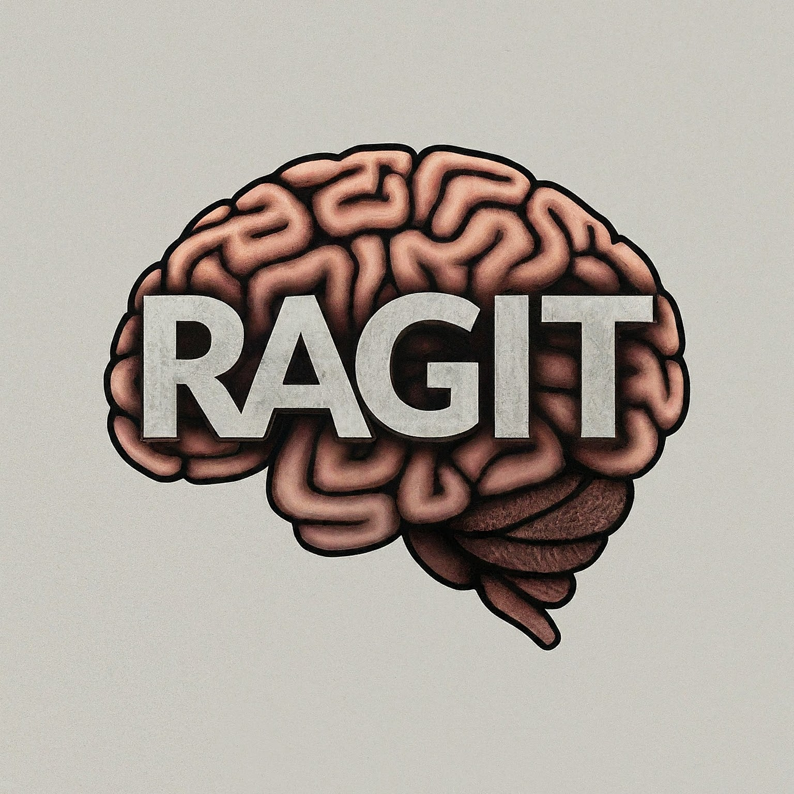

<p align="center">

</p>

## RAGIT

**Customizable Chat Box**

### Overview

RAGIT is a basic HTML-based chat box framework that provides a foundation for
building custom chat interfaces. It includes the core structure, styling, and
basic functionality for displaying messages, sending messages, and handling
user input. The backend integration is left flexible to accommodate various
custom implementations.

### Customization

This project is designed for maximum flexibility and can be easily integrated
with a custom backend. Users can build their own vector database using any
desired documents and connect it to the frontend. This approach offers a generic
solution adaptable to various backend data collections.

### Ragit Configuration File

**Structure**

The configuration file is divided into three main sections:

* **vector_db:** Specifies the location and name of the vector database.
    * `full_path`: The complete path to the database file.
    * `collection`: The name of the collection within the database.
* **web_service:** Defines the web service parameters.
    * `name`: The name of the web service.
    * `port`: The port number for the web service to listen on.
    * `app_name`: The application name for the web service.
* **domain:** Describes the application's domain and purpose.
    * `title`: The title of the application.
    * `description`: A brief description of the application's functionality.

**Usage**

This configuration file is typically used to set up the environment for the
Ragit application. It provides essential information about the database
location, web service settings, and application details.

**Example**

```yaml
vector_db:
  full_path: /home/vagrant/testing_output/dementia/dementia.db
  collection: chunks

web_service:
  name: ragit
  port: 13131
  app_name: ragit

domain:
  title: Alzheimer's Chat Bot
  description: Specializes in  Alzheimer's diagnosis with MRI using AI.
```

By modifying the values in this file, you can customize the Ragit application to
your specific requirements.

## Document Storage

**Document Collection**

The backend process begins by gathering all supported documents (PDF, DOCX, and
Markdown) from a designated directory. These documents serve as the foundation
for RAG creation.

**Document Splitting and Database Insertion**

Each document is divided into smaller chunks, which are then stored in the
database. This process is incremental, allowing for database updates without
requiring all documents upfront.

**Embedding Calculation and Insertion**

To enable vector search, embeddings are computed for each database chunk. A
dedicated process identifies chunks lacking embeddings, calculates them, and
stores the results in the database.

**Vector Database Construction**

The vector database is built or rebuilt using existing document embeddings. This
is the step that makes the embeddings accessible for the RAG service.


## Installation 

**Build the virtual machine**
To install and run RAGIT locally the easiest way is to use a virtual machine
that can be created using vagrant. You will need to have vagrant installed
on your machine . Assuming you already have vagrant installed then you need to
follow these steps to install the repository under your home directory (you
can always install it in any other directory if needed).

```
cd ~
git clone git@github.com:codingismycraft/mygenai.git
mkdir ~/mygen-data
cd mygenai
vagrant up
vagrant ssh
```

Now you can ssh to the newly created virtual machine which should be ready
to go. 

**Create the testing database**
```
cd /vagrant/mygenai/db
./create-db.sh
```


**Run the tests**
```
cd /vagrant/mygenai/
pt
```
